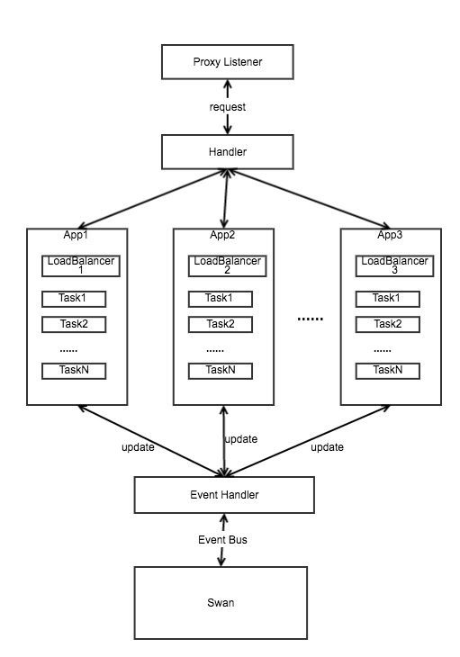

# Proxy设计和实现原理
proxy是基于[swan](https://github.com/Dataman-Cloud/swan)调度器之上的一层设计,其目的是为了解决通过task id或者app id来定位服务地址的问题。
例如当用户请求0.app.user.cluster.domain.com时，proxy通过解析请求的地址，找到其服务实际运行的ip:port,然后将请求反向代理到此ip:port上。

源码地址: [https://github.com/Dataman-Cloud/swan-janitor](https://github.com/Dataman-Cloud/swan-janitor)

## 架构实现:
proxy的设计架构如图所示:



架构实现说明:

proxy服务通过event bus和swan通信,当有实例创建/删除时,swan将此应用实例的ip:port发送到event bus中，proxy监听到此事件，更新app的信息。app的信息存储在proxy的服务中，每个app会存储其运行的实例的ip,port。
当外部请求(app.user.cluster.domain.com)访问proxy时,proxy根据请求的url解析到app id,在内存中找到相应的app信息，通过loadbalancer获取到其中一个实例服务的ip,port,然后反向代理到此ip:port上。
当请求的服务精确到task id时(0.app.user.cluster.domain.com), proxy也会精确的找到对应的实例服务的ip:port,然后反向代理到此ip:port上。

实现约束:

需保证DNS服务器能够识别出域名，并将此域名的请求解析为proxy的服务地址。
proxy服务地址可访问到。
各个应用的服务地址可访问到。

## 详细设计:
整个proxy的设计分四层: upstream, listener, handler, service pod.
upstream管理app和其对应的实例的ip,port信息.
listener分multi_port模式和single_port模式.

# Proxy验证方法
将dns服务地址加在dns配置文件中.
linux的配置文件在/etc/resolv.conf中。
mac可以通过"系统偏好设置"->"网络"->"选择网络"->"高级"->"DNS"， 在DNS服务器中添加dns服务地址，在搜索域中添加域名范域名的支持。如(*.DOMAIN)
```
nameserver $DNS_ADDR
```
然后可以通过curl请求服务:
```
curl 0.app.user.cluster.domain.com
```

